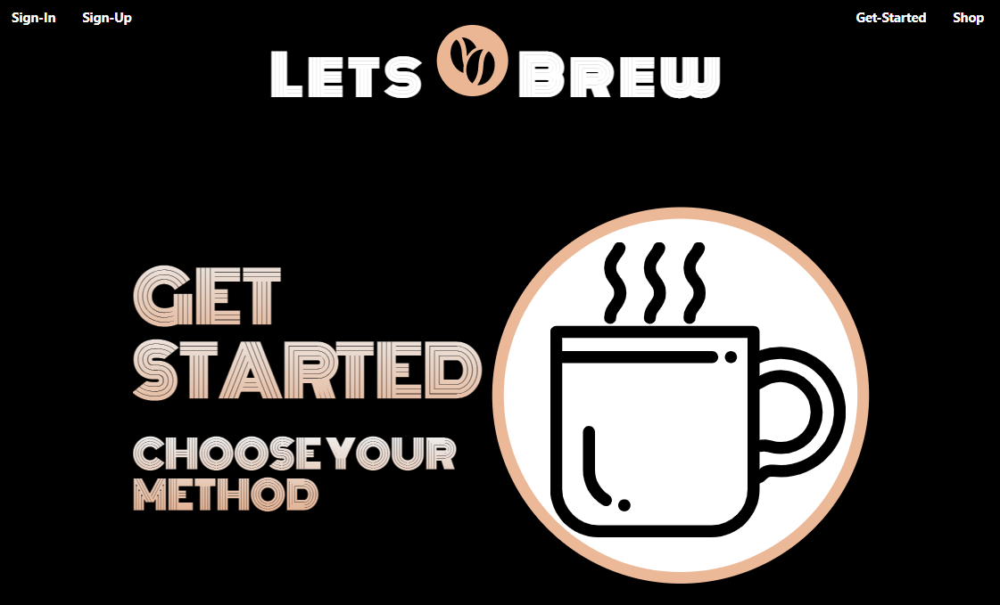

# Lets-Brew

    
   

  ## Description
  Lets-Brew is a single page application built to provide coffee lovers with a place to both learn new methods of brewing, and share their personal favorite cups of joe. 

  ## Table of Contents
  * [Usage](#usage)
  * [Contribution](#contribution)
  * [License](#license)
  * [Questions](#questions)
  
  

 
  ## Usage
  Application is live at https://lets-brew-group12.herokuapp.com/
  
  ## Contribution
  If you would like to conrtibute to this project please reach out!

  ## License
  This project was done under the MIT license to know more about it, please click here: [MIT](https://choosealicense.com/licenses/mit/)

  ## Questions
  Please visit my GitHub page: https://github.com/Sam-Walters93
  
  For more information please email me at: stwalters314@gmail.com
